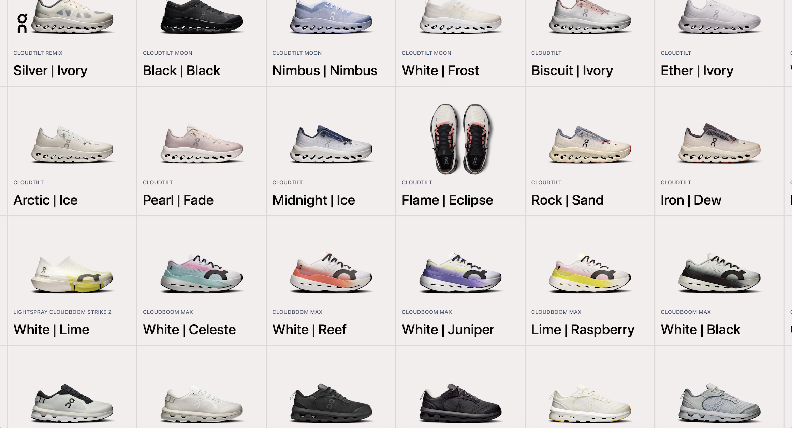
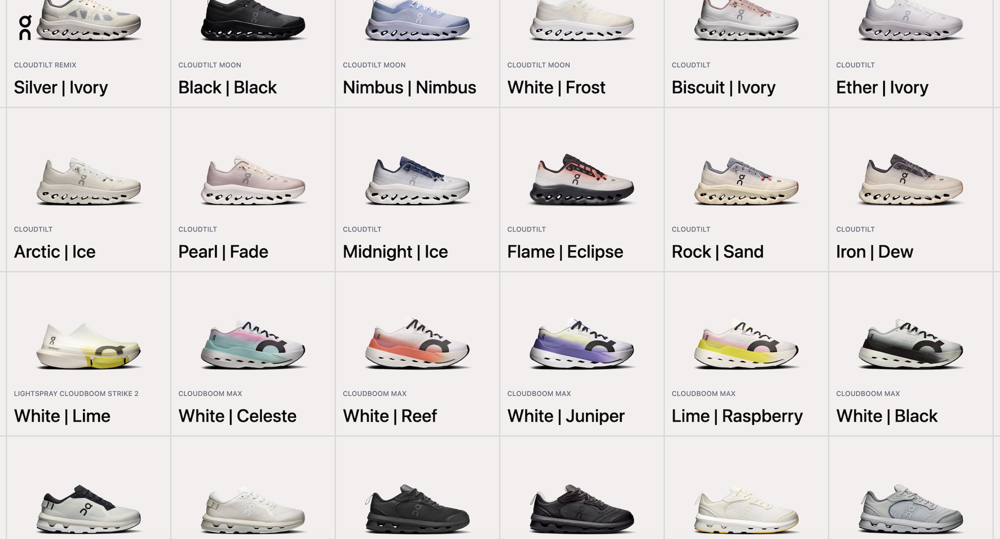

# 👟 Sneaker Canvas Experience

An interactive sneaker website built with HTML, Tailwind CSS, JavaScript, and GSAP.

The first stage of the project focuses on creating a full-screen, draggable sneaker canvas experience that is loaded when the website initially opens.

<p float="left" align="center">

  
  &nbsp;&nbsp;&nbsp;&nbsp;
  <!--  -->
</p>

<br>

## 🛠️ Technologies Used
- HTML5
- JavaScript 
- Tailwind CSS


## 🗺️ Development Roadmap

### Canvas Page
- [x] Create interactive sneaker Canvas
- [x] Add draggable functionality to canvas component
- [x] Render sneaker cards
- [x] Connect sneaker cards to Modal Screen
- [ ] Connect collection cards to Collection Screen

### Product Modal Page
- [x] Attach and displays sneaker Modal Page
- [ ] Add product image gallery
- [ ] Add swipeable image slideshow
- [ ] Add related sneakers 

### Collection Page
- [ ] Create Collection Page
- [ ] Create Collection product grid
- [ ] Render only the first sneaker for each collection of sneakers

<br/>

## 📁 Project Structure

The project follows a component-based structure without relying on a JavaScript framework
```
sneaker-ecommerce/
│
├── public/
│   └── favicon.png
│
├── src/
│   │
│   ├── components/
│   │   ├── Header.js
│   │   └── Canvas/
│   │   │    └── canvas.js
│   │
│   ├── data/
│   │   └── sneakers.js
│   │
│   ├── css/
│   │   └── style.css
│   │
│   └── app.js
│   │
│   │
├── index.html
├── package.json
├── package-lock.json
├── vite.config.js
├── README.md
└── .gitignore
```

## 📌 Future Screens

The project will eventually contain three main experiences:

1. Canvas Screen
   └── Main interactive landing experience

2. Collection Screen
   └── Sneaker collection/grid

3. Modal Screen
   └── Individual sneaker/product details

For now, development is focused only on the Canvas Screen.

## 🔌 Product Data API
Currently, sneaker data is stored directly inside: ```src/data/sneakers.js``

As the project grows, this data will eventually be moved to an external API.

The current local data file has grown considerably, so separating the product data from the frontend will make the application easier to maintain and provide a foundation for a more realistic e-commerce architecture

The frontend will eventually fetch sneaker information dynamically rather than importing the entire product dataset directly.

### Planned API Features
- Fetch all sneakers
- Fetch individual sneakers
- Fetch collections
- Fetch sneakers by collection
- Return product images
- Return product information

The eventual goal is to remove the dependency on the local sneakers.js dataset and have the application consume data through API requests.

## ⚠️ Learning Project & Content Disclaimer

This project is created strictly for learning and educational purposes.
The sneaker images, product information, names, descriptions, pricing, and other product-related content used in this project are not my own. They are being used as reference/demo content while I practice frontend development and recreate an e-commerce-style experience.

The product content is based on [On's THE ROGER collection](https://theroger.com/en/products?ref=landing.love).
This project is not affiliated with, endorsed by, or associated with On.
No commercial use of the third-party product content is intended.


## 📌 Project Status

This project is actively being developed.

The Canvas experience is currently the main focus, with the Product Modal, Collection Screen, and API architecture planned as subsequent stages.
Features marked as incomplete in the roadmap are planned improvements rather than currently implemented functionality.